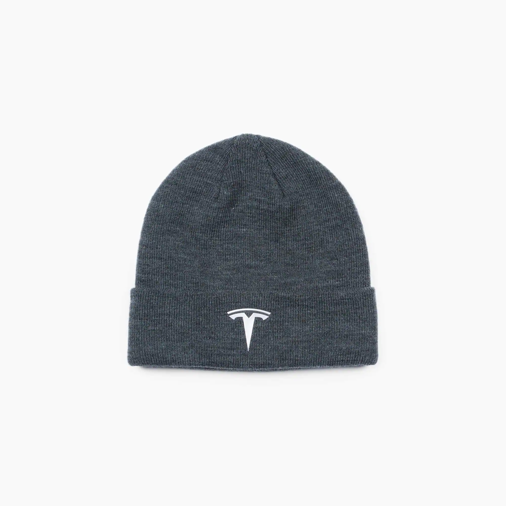

# DmgShop NextJS Ecommerce



Para correr localmente, se necesita la base de datos

```
docker-compose up -d
```

- El -d significa **detached**

## Configurar las variables de entorno

Renombrar el archivo **.env.template** a **.env**

- MongoDB URL Local:

```
MONGO_URL=mongodb://localhost:27017/dmgdb
```

- Reconstruir los modulos de NodeJS y levantar Next:

```
yarn install
yarn dev
```

## Llenar la Bd con informacion de pruebas

Llamara:

```
    http://localhost:3000/api/seed
```

# Next.js DmgShop App

para ejecutar en local necesita la base de datos local

```
docker-compose up -d
```

- MongoDB URL Local:
  yarn install
  yarn dev

```
  mongodb://localhost:27017/dmgdb
```

## Pre-requisitos

- Node
- Yarn

## Ejecuta la app en " Desarrollo "

```
1.- yarn install
2.- yarn dev
```

## Ejecuta la app en " Producción "

```
1.- yarn install
2.- yarn build
3.- yarn start
```

## Tecnologias usadas

- Yarn
- React
- NextJs
- Docker
- Mongo
- Material UI

## Realizado por ✒️

- **David Moreno** - _FullStack-Developer_ - [DavidMG](https://github.com/DavidMorenoGuirao)

---

⌨️ with ❤️ by [IsmaelJDz7](https://github.com/IsmaelJDz) 😊
